**1**
- Create the user
```shell
useradd -c "testing" xyz
```
- to make user the user created
```shell
grep xyz /etc/passwd
```
**2,3,4**
```shell
chage -m 3 -M 90 -W 4 xyz
```

**5**
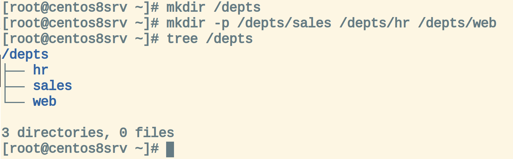
---

**6**
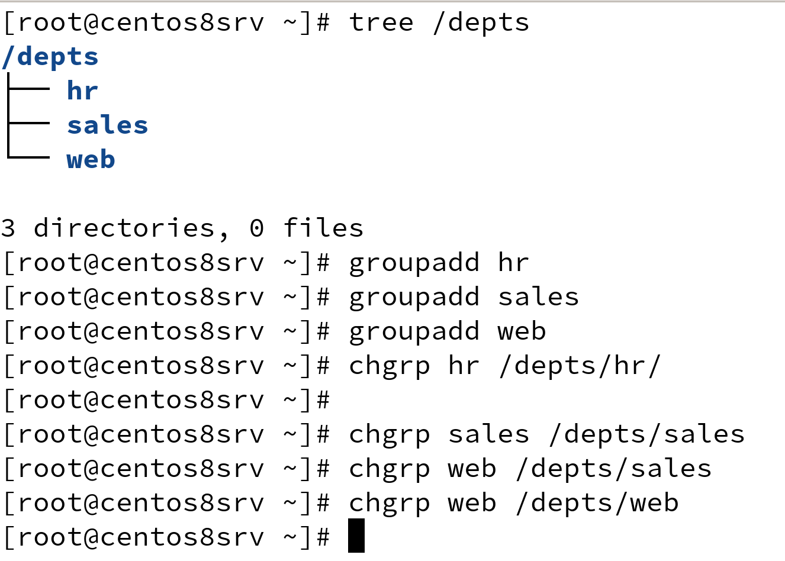

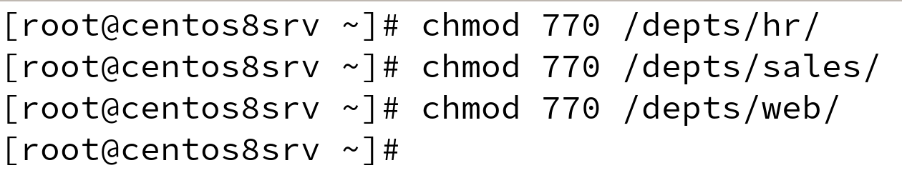
---

**7**
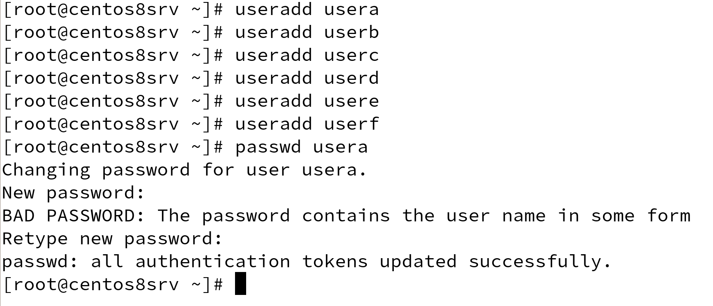

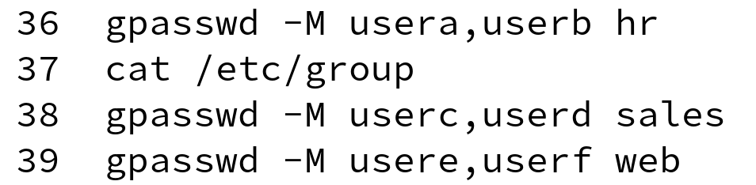
---


**8**
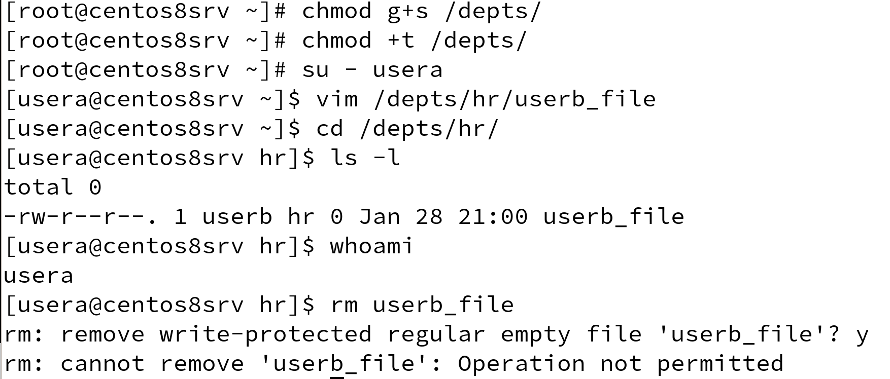
---

**9,10,11**
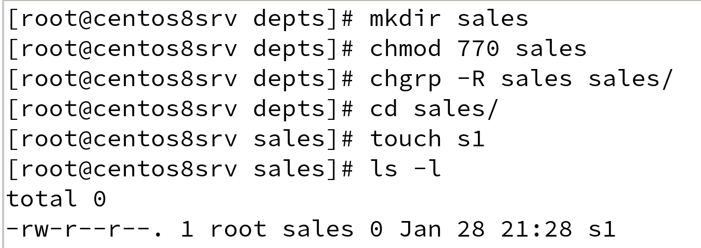

---

**13**
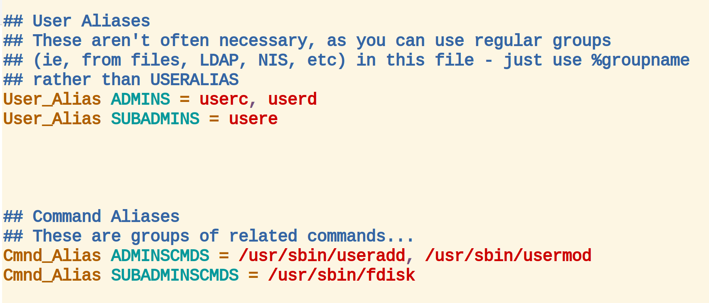
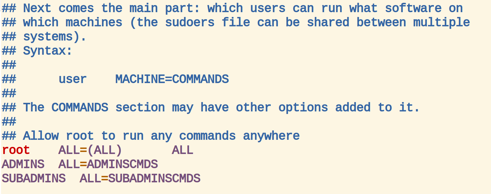
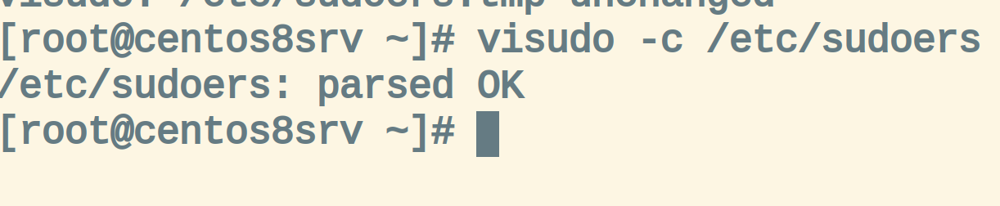

---
**14**
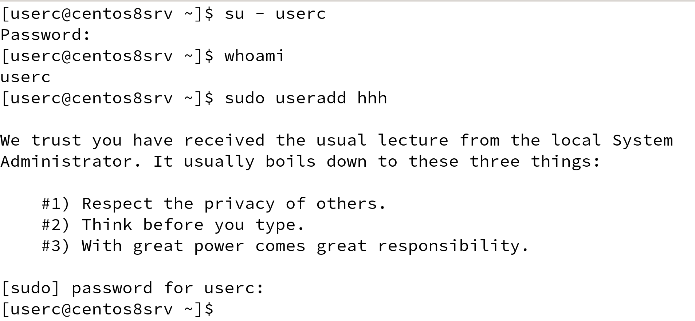
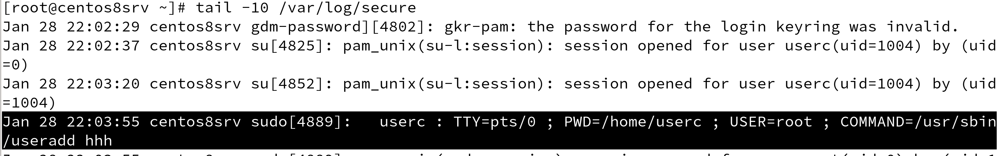

---
**15**
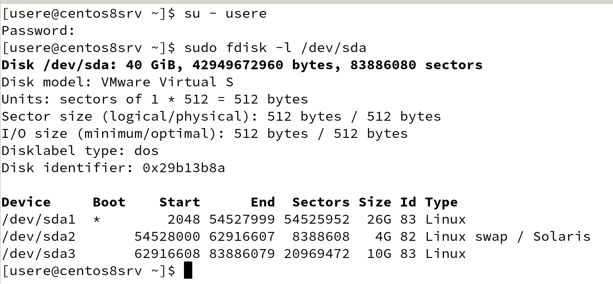