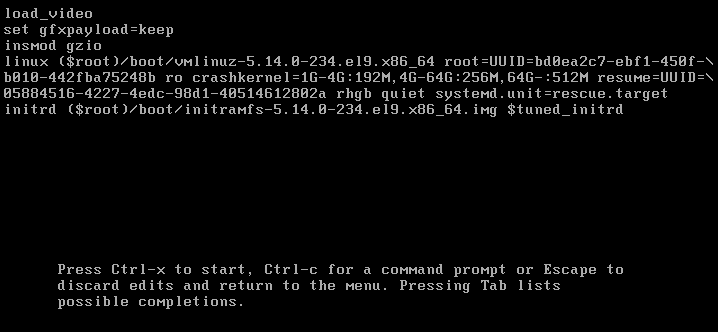
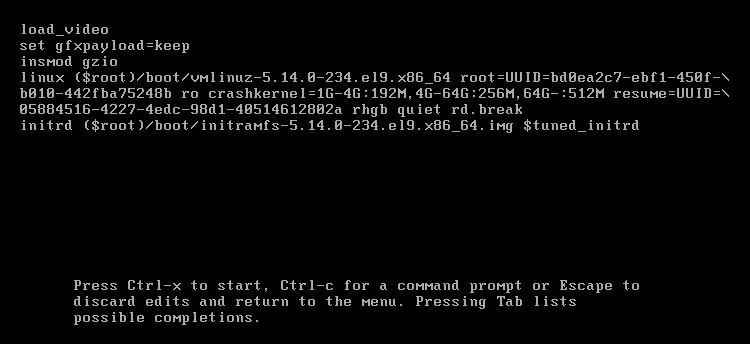
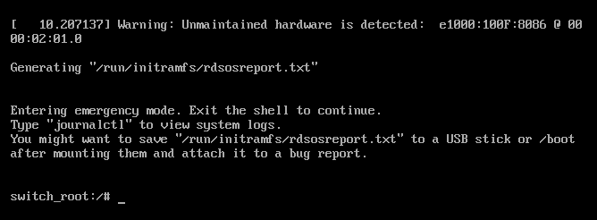
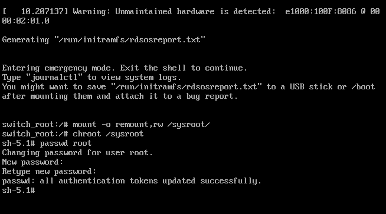
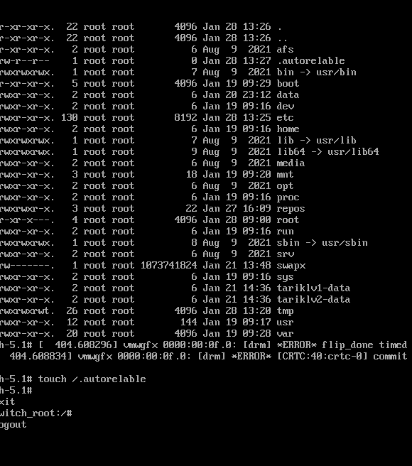

**1**
- Edit the file:
```bash
vim /etc/default/grub
```
- Edit this line:
```bash
GRUB_TIMEOUT=8
```
  
- After any changes you should run the command

``` bash
grub2-mkconfig -o /boot/grub2/grub.cfg
```

**2**
- Run the command
```bash
systemctl isolate multi-user.target
```

**3**
- Edit the file:
```bash
vim /etc/default/grub
```
- Edit the line starting with
```bash
GRUB_CMDLINE_LINUX=
```
- At the end of the string add the following:
``` bash

GRUB_CMDLINE_LINUX=" ... systemd.unit=multi-user.target"
```
> :bulb: tNOTE: The three dots(...) means append to the string, so don't write them in the string
- The resulting line will be something like this:
```bash
GRUB_CMDLINE_LINUX="crashkernel=1G-4G:192M,4G-64G:256M,64G-:512M resume=UUID=05884516-4227-4edc-98d1-40514612802a rhgb quiet systemd.unit=multi-user.target"
```

**4**

- Reboot the machine
- When the grub menu appeared press `e`
- you'll find a line starting with `linux ($root)/` or `linux16 ($root)/` on legacy systems, append the following
  at the end of this line
```bash
... systemd.unit=rescue.target
```
- Press `Ctrl+x`

>Result




**5**

```bash
systemctl set-default graphical.target
```

**6**

```bash
systemctl status sshd
```
**7**
```bash
systemctl restart sshd
```

**8**
```bash
systemctl reload sshd
```
**9**
```bash
systemctl list-units --type service --all |grep chronyd
```
**10**
```bash
systemctl stop chronyd
```
```bash
systemctl status chronyd
```
**11**

```bash
systemctl list-unit-files --type service --all | grep chronyd
```
**13**
```bash
systemctl disable chronyd
```
**15**

- Reboot the machine
- When the grub menu appeared press `e`
- you'll find a line starting with `linux ($root)/` or `linux16 ($root)/` on legacy systems, append the following
  at the end of this line
```bash
... rd.break
```
- Press `Ctrl+x`

-Enter the command
```
mount -o remount,rw /sysroot
```
```
chroot /sysroot
```
> The prompt will look like this `sh#`
-Enter the command
```
passwd root
```
- Enter and Confirt the new password
- Enter the command
```
touch /.autorelable
```
- Press `Ctrl+d` Twice

>Steps







